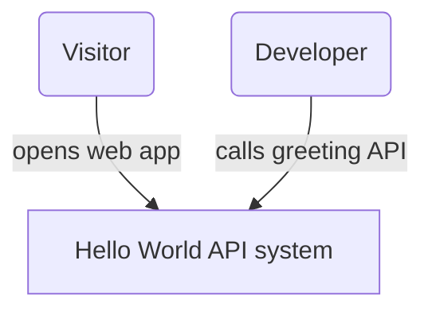
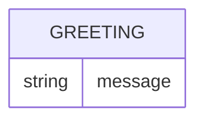
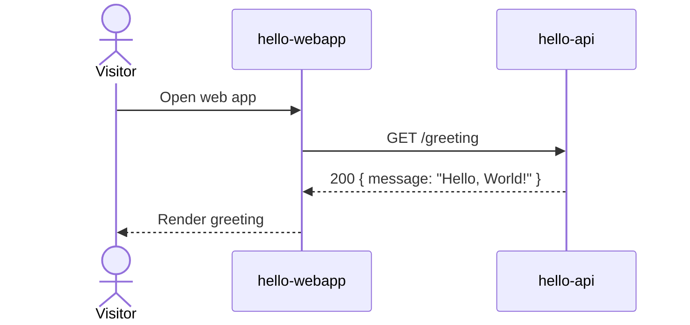
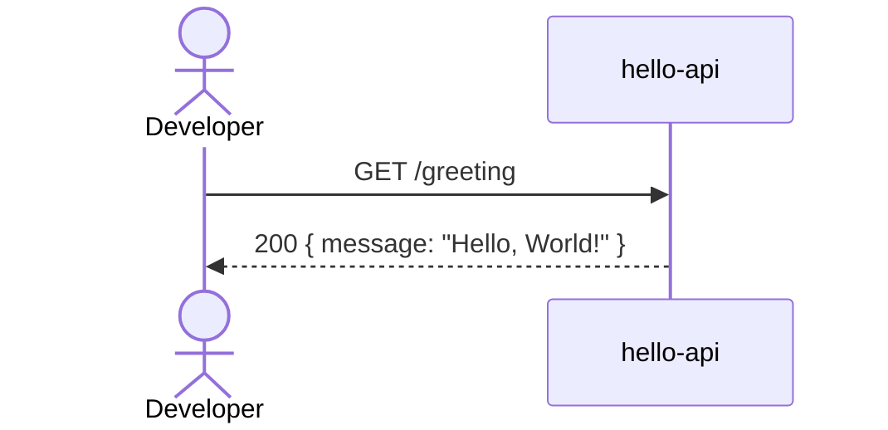

# Hello World API — Design

## Overview

A minimal end-to-end reference: `hello-api`, a Go service, exposes a
single public endpoint that always returns a static "Hello, World!" greeting;
`hello-webapp`, a React single-page app, calls that endpoint and renders the
greeting on screen. Both are public with no sign-in, so a Visitor can open the
web app and a Developer can call the API directly and see the same result.

## Context (C1)

## Domain model (ER)

The system holds no persisted data — the greeting is a fixed, computed value
with no storage. The single shape returned by the API is modeled below for
completeness; it becomes the `Greeting` schema in `hello-api`'s OpenAPI spec.

## Key flows

### Visitor opens the web app

### Developer calls the API directly

